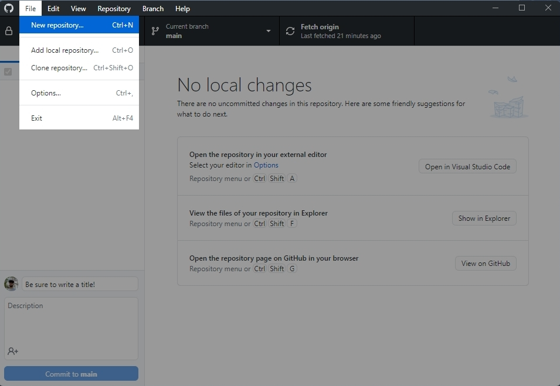
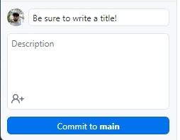
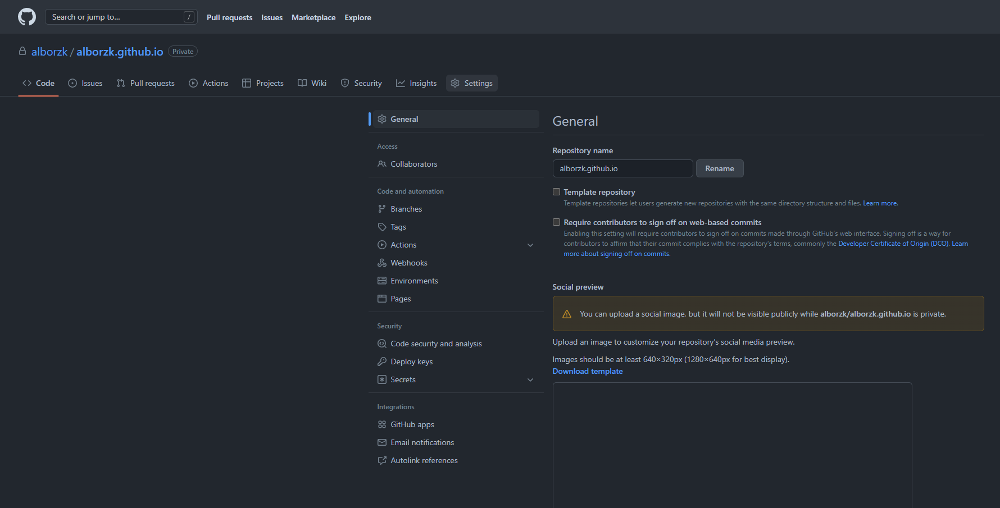
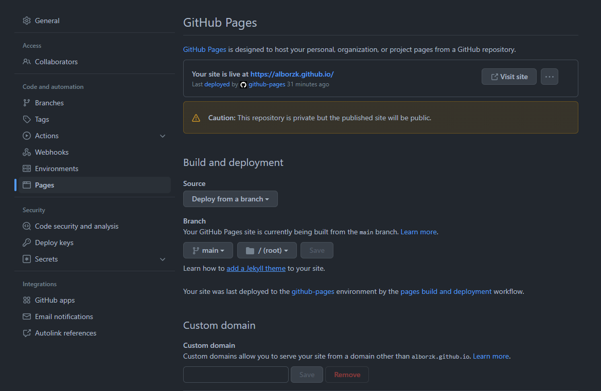
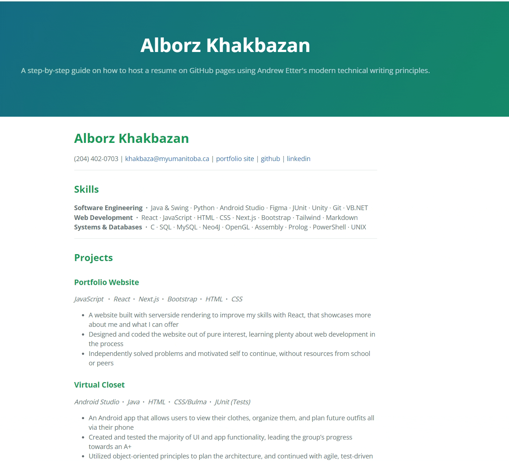

# Applying Etter's _Modern Technical Writing_ Principles to Host an Online Resume and README
### COMP 3040 Assignment 2 -- Alborz Khakbazan  -- Fall 2022

---

### Purpose

The goal of this readme is to describe the practical steps of how to host and format a resume using GitHub Pages and Markdown. Additionally, it will relate these steps to the general principles of current Technical Writing, as explained in Andrew Etter's book [_Modern Technical Writing_](https://www.amazon.ca/Modern-Technical-Writing-Introduction-Documentation-ebook/dp/B01A2QL9SS). This guide is intended for a those with a novice level of computer science proficiency, and requires only a limited understanding of these technologies.

### Table of Contents

- [Prerequisites](#prerequisites)

- [Instructions](#instructions)

- [More Resources](#more-resources)

- [Authors and Acknowledgements](#authors-and-acknowledgements)

- [Frequently Asked Questions](#faq)

### Prerequisites

- Create a [GitHub](https://github.com/) account.

- Get some familiarity with [Markdown](https://en.wikipedia.org/wiki/Markdown) - for a quick resource to refresh your memory, see [Wordpress' reference guide](https://wordpress.com/support/markdown-quick-reference/) or [GitHub's documentation](https://guides.github.com/features/mastering-markdown/). Alternatively, you can complete this [tutorial](https://www.markdowntutorial.com/) if you're just learning Markdown for the first time.

- Download [Obsidian](https://obsidian.md/) (or some other Markdown editor capable of editing [GitHub Flavored Markdown](https://github.github.com/gfm/)).

- Create a Markdown-formatted resume (You can do so easily using Obsidian). 

- Optional: If you are unfamiliar with git commands, it may help to download [GitHub Desktop](https://desktop.github.com/) to make commits easier. We will be using it for the purposes of this guide.
  
  - _Why use Markdown?_
    
    - _Markdown corresponds to Etter's key principle on using a lightweight markup language. This is because lighweight markup is easier to read and write in, making it much more widely accessible and allowing for more people to contribute to documentation. Etter specifically recommends Markdown because it is the most widely used lightweight markup language and is more future-proofed than other options._

### Instructions 

This is a step-by-step demonstration on how to host a resume on GitHub Pages, while also relating to _Modern Technical Writing_'s key principles. 

1. Create a new GitHub repository called `[YourUsername].github.io`. For example, you can see that this repository is called `alborzk.github.io`.
   
   - On Github Desktop, you can do this by clicking File > New Repository.   
      
	- *Why use GitHub?*
  
	  - *GitHub corresponds to Etter's key principle on using distributed version control. It provides better performance, facilitates concurrent work on the same file, and makes it easy to undo changes. It also makes your job easier, since a developer, tester, or experienced user can make changes to the documentation easily if something is incorrect or out of date.*
1. Commit your markdown-formatted resume to your GitHub repository. 
   
   - On GitHub Desktop: 
     
     - First, add the resume to your local repository by clicking Repository > Show in Explorer and moving or copying your resume.md file to the folder that opens.
    
     - Once the resume has been added to your local repository, you can [commit](https://github.com/git-guides/git-commit) your changes to the remote repository using the "commit" panel at the bottom left. Be sure to fill in an appropriate title for the commit.
      

3. Push your changes to the remote repository. 
   
   - On GitHub Desktop:
     
     - To [push](https://www.atlassian.com/git/tutorials/syncing/git-push#:~:text=The%20git%20push%20command%20is,exports%20commits%20to%20remote%20branches.) your changes to the remote repository, press "push origin" on the main screen. The option should appear after you create a commit, and may require you to "pull" changes first if your local repository isn't up to date. 

4. Your resume should now be on the GitHub repository. Navigate to the repository in a browser by visiting `github.com/[YourUsername]/[YourRepositoryName]`, and check to make sure your uploaded files are all there.

5. Now that the repository has been set up, we will set up a static site to host the resume using Github Pages and Jekyll.
   
   - Navigate to the settings of the GitHub repository.
   
   - Select the "GitHub Pages" tab and find a [theme](https://pages.github.com/themes/) you like. Don't worry about making the perfect choice - you can always come back and change it later. 
   
   - *Why use GitHub Pages and Jekyll?*
     
     - _GitHub Pages corresponds to Etter's key principle on using static sites. Etter recommends static sites because they are very simple, and are not prone to crashes or hacks._
     
     - _Jekyll corresponds to Etter's key principle on using static site generators. Etter recommends these because they can help create beautiful, functional static sites with minimal effort._

6. Your resume should now be visible on GitHub Pages at `[RepositoryName]/[ResumeFilename]`. For example, the resume that was built for this repository is hosted on GitHub Pages with the link: `https://alborzk.github.io/7882706_A2_resume`, where RepositoryName is `alborzk.github.io` and the ResumeFilename is `7882706_A2_resume`. If not, try waiting a few minutes for the website to be deployed and reload the link, or see the [FAQ](#frequently-asked-questions).

7. Done! Congratulations, and enjoy your new online resume.

### More Resources
  -  [*Modern Technical Writing*](https://www.amazon.ca/Modern-Technical-Writing-Introduction-Documentation-ebook/dp/B01A2QL9SS) By Andrew Etter

### Authors and Acknowledgements

- Written by: Alborz Khakbazan

- Edited by:

  - Noah Curoe
  
  - Kunal Rajpal
  
  - Tristan Dyck
  
- Jekyll theme: [Slate](https://github.com/pages-themes/slate)

- Template credit: 
  
  - University of Manitoba
  
  - Course: COMP 3040 A01, Fall 2022
  
  - Course Instructor: Stewart Wilcox

### Frequently Asked Questions

###### Why is Markdown better than a word processor?

- Markdown is a markup language that is designed for the web, and to have CSS run through it with ease. This is why websites use markup languages instead of Microsoft Word .docx files - you can see how messy that would look by the [source code](https://www.toptal.com/xml/an-informal-introduction-to-docx) for a .docx file.

**I can see the README on Github Pages but not my resume. What's wrong?**

- If this is the case, make sure you are being specific with the url you are visiting. Instead of viewing `https://RepositoryName/ResumeFilename`, you might be viewing `https://RepositoryName/` or `https://RepositoryName/ReadmeFilename`.

